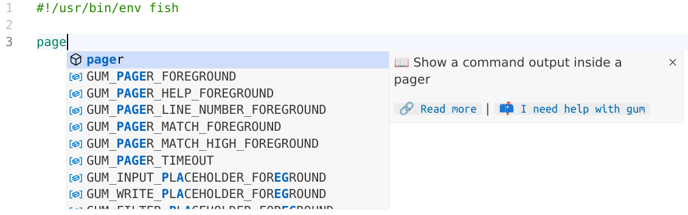

# Gum

## Description

Provides user-friendly snippets for `gum`-based projects in Fish shell.

## Installation

Installation steps are explained [here][installation].

[installation]: https://code.visualstudio.com/docs/editor/extension-marketplace#_install-from-a-vsix

## Features

- [x] Snippets for subcommands, e.g. for `choose` subcommand
- [x] Snippets for environment variables, e.g. for `GUM_CHOOSE_ORDERED` variable
- [x] Snippets for templates, e.g. for `Bold` template

## Screenshots

